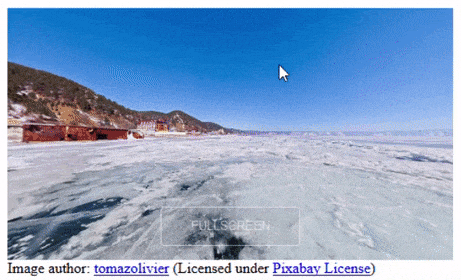
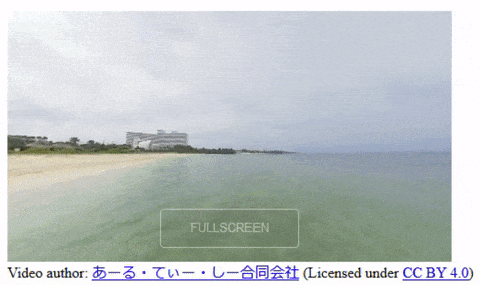

Status: In development. [Any feedback is very welcome.](https://github.com/MozillaReality/immersive-custom-elements/issues)

# Immersive Custom Elements

`immersive-custom-elements` is a set of web components to embed immersive (VR & AR) content into 
your web page by using custom element tags. It currently includes components for

* 360 images
* 360 video
<!-- * 360 image tours -->


[Demo](https://rawcdn.githack.com/MozillaReality/immersive-custom-elements/v0.1.0/examples/index.html)

## Background

Creating immersive content directly with WebGL and WebXR(VR) requires deep knowledge of 3D graphics.
Tools which address this problem tend to be very rich and take time to learn.

We think there are a lot of simple use cases where content creators want very simple 
interactions but they don't have the knowledge or time to create and maintain a custom application 
built on top of WebXR frameworks.

The `immersive-custom-elements` project provides a standard way to create *exmples* without detailed knowledge of 3D, WebXR or 
even Javascript.

## Usage

### Sample code

Add the link to `immersive-custom-elements.js` with `<script>` tag. You can download the file from this repository or use the link to the CDN.

```html
<html>
  <head>
    <script src="https://rawcdn.githack.com/MozillaReality/immersive-custom-elements/v0.1.0/build/immersive-custom-elements.js"></script>
  </head>
  <body>
    </img-360>
  </body>
</html>
```

## Custom element tags

- \
- \<video-360\>
<!-- - \ -->
- other new elements coming later

If you have any new custom element tag ideas, join [this brainstorming thread](https://github.com/MozillaReality/immersive-custom-elements/issues/9)!

### \

Displays an interactive 360 degree photo.

```javascript
</img-360>
```

| attribute | type | description |
| ---- | ---- | ---- |
| src | strings | Path to image file |
| width | number | element width |
| height | number | element height |



### \<video-360\>

Plays an interactive 360 degree video. Click video to start playing.

```javascript
<video-360 src="video.mp4" width="640" height="360"></video>
```

| attribute | type | description |
| ---- | ---- | ---- |
| src | strings | Path to video file |
| width | number | element width |
| height | number | element height |
| loop | - | video loops if defined |
| muted | - | the audio output of the video is muted if defined |
| autoplay | - | video automatically starts playing if defined |



<!--
### \

Displays a set of interactive 360 degree photos. You can switch between photos by gazing at white plane for three seconds.

```javascript

  </img-360-tour-item>
  </img-360-tour-item>
  </img-360-tour-item>
</img-360-tour-item>
```

\

| attribute | type | description |
| ---- | ---- | ---- |
| width | number | element width |
| height | number | element height |

\

| attribute | type | description |
| ---- | ---- | ---- |
| src | strings | Path to image file |


-->

## Immersive (VR) mode

You can enter immersive mode by clicking "ENTER VR" button if you have a HMD.


## 360 degree photo/video

360 degree photo/video is a interactive panoramic image/video.

You will need a special camera or application to take 360 degree photos and videos.

### 360 degree Cameras

- [RICOH THETA](https://theta360.com/)
- [INSTA360](https://www.insta360.com/)
- [GoPro FUSION](https://shop.gopro.com/EMEA/cameras/fusion/CHDHZ-103-master.html)

## Browsers and headsets

Currently we test this project on the following platforms.

- Firefox/Chrome on Desktop
- Firefox Reality/Oculus Browser on Oculus Go/Quest

[Feedback from other platforms are very welcome.](https://github.com/MozillaReality/immersive-custom-elements/issues)

## Development

### How to build

```sh
$ git clone https://github.com/MozillaReality/immersive-custom-elements.git
$ cd immersive-custom-elements
$ npm install
$ npm run build
```

### How to locally run

```sh
$ npm run start
# local server boots up. Access http://localhost:8080/examples/index.html on your browser.
```

## Similar projects

- [model-viewer](https://github.com/GoogleWebComponents/model-viewer)
- [A-Frame](https://aframe.io/)

## License

Mozilla Public License Version 2.0
